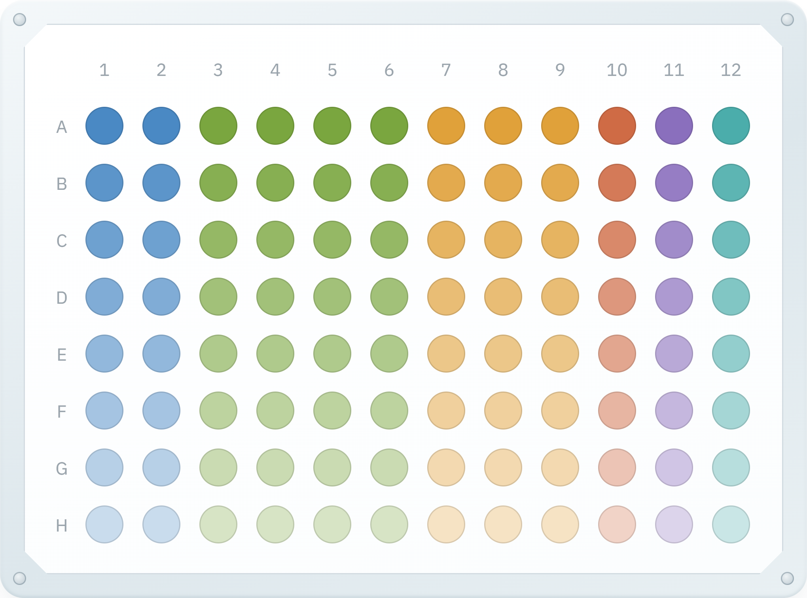

# 96-Well Plate Editor

A browser-based tool for designing and exporting 96-well plate layouts. Built as a single self-contained HTML file — no install, no server, just open it in a browser.

## Features

- **Paint mode** — pick a color from the palette and click or drag across wells to fill them
- **Dilution series mode** — select a run of wells, set start/end intensity, and apply a fade (across, down, or in click order)
- **Custom palette** — add, rename, remove, and recolor swatches (hex, RGB, or CMYK input), with a live count of wells using each color
- **Draggable panels** — the dilution and color-editor panels float over the plate and can be repositioned
- **Export** — captures the plate as a PNG (via `html-to-image`) with a download/open-in-new-tab dialog

## Usage

1. Open the HTML file in any modern browser.
2. Choose **Paint** or **Dilution series** from the tab toggle.
3. Select or edit a color in the legend panel.
4. Click/drag wells on the plate to apply.
5. Click **Export PNG** to save the plate image.

## Example Images

